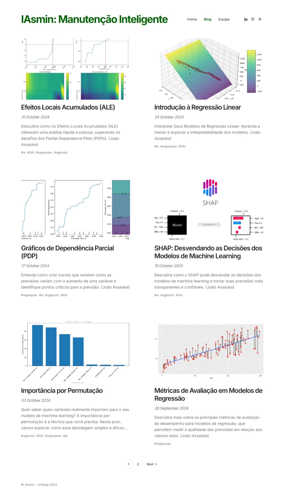

<h1 align="center"> 
    🏭 IAsmin: Manutenção Inteligente 🏭  
</h1> 

## Quem somos?

 
    &emsp;&emsp; O projeto de Manutenção Prescritiva na Indústria 4.0 tem como objetivo prever falhas e otimizar o desempenho de equipamentos industriais utilizando tecnologias avançadas como Internet das Coisas (IoT), inteligência artificial (IA) e Big Data. 
    &emsp;&emsp; Por meio da coleta contínua de dados em tempo real dos sensores instalados nas máquinas, os algoritmos de machine learning analisam o estado atual dos equipamentos, identificam padrões de desgaste e preveem quando uma falha pode ocorrer. 
    &emsp;&emsp; Além da previsão, a manutenção prescritiva vai além, recomendando ações corretivas específicas para evitar interrupções, aumentar a vida útil dos ativos e otimizar processos de manutenção, garantindo assim maior eficiência operacional e redução de custos. Esse modelo se alinha aos conceitos da Indústria 4.0, promovendo automação inteligente e tomada de decisão baseada em dados.

## Nosso Site:

 
    &emsp;&emsp;Desenvolvemos um hub educacional para disseminar conhecimentos sobre Manutenção Inteligente utilizando Inteligência Artificial. Nosso site funciona como um blog, onde publicamos conteúdos didáticos e práticos sobre temas relevantes.  
    &emsp;&emsp;Cada post publicado na plataforma segue uma estrutura didática cuidadosamente planejada:
    <ul>
        <li><strong>Introdução:</strong> Contextualização do tema.</li>
        <li><strong>Intuição do Funcionamento:</strong> Explicação conceitual, utilizando analogias e exemplos práticos.</li>
        <li><strong>Implementação:</strong> Código-fonte explicado.</li>
        <li><strong>Laboratório Prático:</strong> Link para um ambiente no Google Colab contendo o código completo, permitindo experimentação e adaptação.</li>
    </ul>
    &emsp;&emsp;Essa estrutura foi desenhada para atender tanto iniciantes quanto profissionais experientes, oferecendo diferentes níveis de profundidade no conteúdo.

## Equipe de Desenvolvimento:
### Professora Responsável
| Nome | Instituição | Contato |
| --- | --- | --- |
| Lilian Berton | UNIFESP |    |

### Professores Associados
| Nome | Instituição | Contato |
| --- | --- | --- |
| Adriano Galindo Leal  | IPT ||
| André Kazuo Takahata | UFABC ||
| Denis Bruno Virissimo | IPT ||
| Didier Vega Oliveros | UNIFESP ||
| Henrique Mohallem Paiva | UNIFESP ||
| João Roberto Bertini Junior | Unicamp ||

### Pós-Doutorando
| Nome | Instituição | Contato |
| --- | --- | --- |
| Kanak Kalita | Unifesp ||

### Doutorado
| Nome | Instituição | Contato |
| --- | --- | --- |
| Abelardo Nascimento Filho | UFABC ||
| Adalberto Mineiro de Andrade | Unifesp ||
| Joel Frank Huarayo Quispe | Unifesp ||

### Mestrado
| Nome | Instituição | Contato |
| --- | --- | --- |
| Lucas Zilig Barros de Oliveira | Unifesp ||
| Stephanie Leong de Oliveira | Unifesp ||

### Iniciação Científica
| Nome | Instituição | Contato |
| --- | --- | --- |
| Arthur Passos |  ||
| Guilherme Pereira Campos | Unifesp ||
| Jean Lucas Luquetti Silva | Unifesp ||
| João Victor Assaoka Ribeiro | Unifesp |    |
| José Augusto da Costa Caldeira | Unifesp ||
| Lucas Molinari | Unifesp |     |
| Murilo Capozzi dos Santos | Unifesp ||
| Thiago Roberto Fernandes Rocha | Unifesp ||
| Rafael da Silva Medeiros | Unifesp ||
